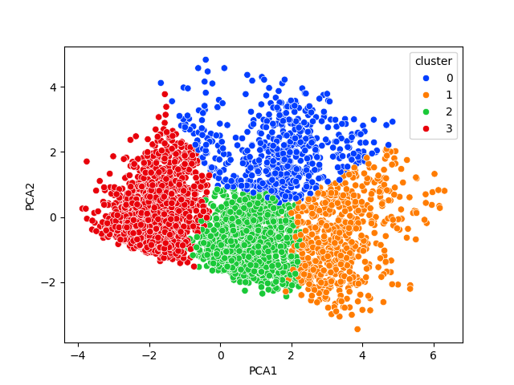

# 🌍 Pollution Level Clustering Project

This project uses unsupervised learning (clustering) to group regions based on air pollution and environmental factors. The goal is to see if **KMeans** clustering can reveal patterns that reflect pollution levels — without using any pre-labeled pollution score.

---

## Parameters in Dataset

The dataset includes the following features:

- Temperature  
- Humidity  
- PM2.5  
- PM10  
- NO₂ (Nitrogen Dioxide)  
- SO₂ (Sulfur Dioxide)  
- CO (Carbon Monoxide)  
- Proximity to Industrial Areas  

These features influence the overall **air quality** of a region.

---

## What the Project Does

1. **Preprocessing**
   - Handle missing values and remove any outliers
   - Prepare the dataset for clustering

2. **Data Scaling**
   - Use `StandardScaler` to normalize environmental features

3. **Dimensionality Reduction**
   - Apply `PCA` to reduce the number of features while keeping important patterns

4. **Clustering**
   - Use `KMeans` to group regions with similar pollution characteristics
   - Visualize clusters to understand pollution zones

---

## Tools Used

```python
import pandas as pd  
import numpy as np  
import seaborn as sns  
import matplotlib.pyplot as plt  
from sklearn.decomposition import PCA  
from sklearn.preprocessing import StandardScaler  
from sklearn.cluster import KMeans  
```

## Results (Streamlit):




## Report

A short report of the clusters : Pollution Cluster Analysis.docx
